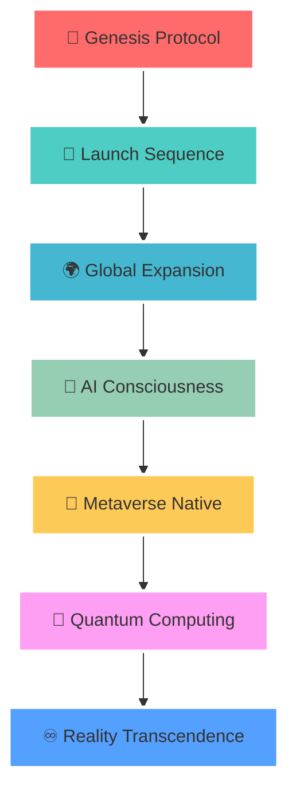

# 🌌 **GIVVE** × **20's DEVELOPERS**
### *⚡ Architecting Tomorrow's Digital Multiverse ⚡*

<div align="center">

![Holographic Logo]
*🔮 Interactive 3D Logo - [Replace with actual holographic animation]*


</div>

---

## 🚀 **QUANTUM INITIALIZATION PROTOCOL**

<div align="center">


*🎯 Interactive 3D System Monitor - [Replace with WebGL animation]*

</div>

```bash
╔══════════════════════════════════════════════════════════════╗
║  > Initializing GIVVE × 20's Developers Neural Network...   ║
║  > Loading Quantum Computing Matrix...            ████ 100% ║
║  > Activating Multi-Reality Infrastructure...     ████ 100% ║
║  > Deploying AI Consciousness Layer...            ████ 100% ║
║  > Status: ⚡ HYPER-OPERATIONAL ⚡                           ║
║  > Reality Index: ∞ UNLIMITED                              ║
╚══════════════════════════════════════════════════════════════╝
```

**GIVVE × 20's Developers** isn't just a development studio—we're reality architects crafting the infrastructure for tomorrow's digital civilization. From quantum-powered applications to immersive metaverse experiences, we transform impossible ideas into extraordinary realities.

---

## 🌟 **OMNIVERSAL SERVICE MATRIX**

<div align="center">


*🌐 Interactive Service Selection Portal - [Replace with 3D hologram]*

</div>

<table>
<tr>
<td width="33%">

### 🎮 **ENTERTAINMENT & GAMING**
- 🕹️ **Immersive Game Development**
- 🎬 **Interactive Storytelling Platforms**
- 🎵 **Music & Art Creation Tools**
- 🏟️ **Virtual Event Experiences**
- 🎪 **Social Gaming Ecosystems**

</td>
<td width="33%">

### 🏥 **HEALTHCARE & WELLNESS**
- 🧬 **AI-Powered Diagnostics**
- 💊 **Personalized Medicine Platforms**
- 🧘 **Mental Health VR Therapy**
- 🏃 **Fitness & Wellness Tracking**
- 🩺 **Telemedicine Solutions**

</td>
<td width="33%">

### 🎓 **EDUCATION & LEARNING**
- 📚 **Interactive Learning Platforms**
- 🔬 **Virtual Science Laboratories**
- 🌍 **Global Classroom Networks**
- 🎯 **Skill Assessment Systems**
- 🧠 **Adaptive AI Tutoring**

</td>
</tr>
<tr>
<td>

### 🏢 **ENTERPRISE & BUSINESS**
- 📊 **Data Visualization Suites**
- 🤝 **Virtual Collaboration Tools**
- 🏭 **Supply Chain Optimization**
- 💼 **Digital Twin Solutions**
- ⚡ **Automation Frameworks**

</td>
<td>

### 🛒 **E-COMMERCE & FINTECH**
- 🛍️ **Virtual Shopping Experiences**
- 💳 **Blockchain Payment Systems**
- 📈 **AI Trading Platforms**
- 🏪 **Decentralized Marketplaces**
- 💰 **DeFi Protocol Development**

</td>
<td>

### 🌍 **SOCIAL & COMMUNITY**
- 👥 **Metaverse Social Networks**
- 🗳️ **Digital Governance Platforms**
- 🌱 **Sustainability Tracking**
- 🏘️ **Smart City Solutions**
- 🤖 **AI Community Assistants**

</td>
</tr>
</table>

---

## ⚡ **ADVANCED TECHNOLOGY ARSENAL**

<div align="center">


*🔧 Dynamic Technology Web - [Replace with interactive 3D tech globe]*

</div>

### 🌐 **FRONTEND REALITY ENGINE**
```yaml
Core Frameworks: 
  - React 18+ (Concurrent Features, Suspense)
  - Vue 3+ (Composition API, Teleport)
  - Angular 16+ (Standalone Components, Signals)
  - Svelte/SvelteKit (Reactive Compiler)
  - Next.js 14+ (App Router, Server Components)
  - Nuxt 3+ (Nitro Engine, Auto-imports)

3D & Immersive:
  - Three.js (WebGL 3D Graphics)
  - Babylon.js (Advanced 3D Engine)
  - A-Frame (WebXR Framework)
  - React Three Fiber (React + Three.js)
  - WebXR APIs (VR/AR Native)
  - WebGL/WebGPU (Low-level Graphics)

UI/UX Innovation:
  - Framer Motion (Advanced Animations)
  - Lottie (Vector Animations)
  - GSAP (Professional Animation Suite)
  - CSS Houdini (Custom Properties API)
  - Web Components (Custom Elements)
  - Progressive Web Apps (PWA)
```

### 🚀 **BACKEND QUANTUM INFRASTRUCTURE**
```yaml
Core Technologies:
  - Node.js (V8 Engine, Event Loop)
  - Python (FastAPI, Django, Flask)
  - Rust (Memory Safety, Performance)
  - Go (Concurrency, Microservices)
  - Java/Kotlin (Spring Boot, Enterprise)
  - C# (.NET Core, Azure Integration)

Database Ecosystem:
  - PostgreSQL (Advanced SQL, JSONB)
  - MongoDB (Document Store, Atlas)
  - Redis (In-Memory, Caching)
  - Neo4j (Graph Database)
  - InfluxDB (Time Series)
  - Supabase (Real-time, Postgres)

API & Communication:
  - GraphQL (Type-safe APIs)
  - gRPC (High-performance RPC)
  - WebSockets (Real-time Communication)
  - Server-Sent Events (Live Updates)
  - REST APIs (RESTful Architecture)
  - Microservices (Distributed Systems)
```

### 🤖 **ARTIFICIAL INTELLIGENCE & MACHINE LEARNING**

<div align="center">


*🧠 Neural Network Visualization - [Replace with animated brain connectivity]*

</div>

```yaml
Deep Learning Frameworks:
  - TensorFlow 2.x (Production ML)
  - PyTorch (Research & Development)
  - JAX (High-performance Computing)
  - Hugging Face Transformers (NLP)
  - OpenCV (Computer Vision)
  - Scikit-learn (Classical ML)

Advanced AI Technologies:
  - Large Language Models (GPT, Claude, Llama)
  - Computer Vision (Object Detection, Segmentation)
  - Natural Language Processing (Sentiment, Translation)
  - Reinforcement Learning (Game AI, Robotics)
  - Generative AI (Image, Text, Code Generation)
  - Neural Architecture Search (AutoML)

MLOps & Deployment:
  - Kubernetes (Container Orchestration)
  - Docker (Containerization)
  - MLflow (Model Lifecycle Management)
  - Apache Airflow (Workflow Orchestration)
  - NVIDIA CUDA (GPU Acceleration)
  - Edge AI (Mobile, IoT Deployment)

Specialized AI Applications:
  - Recommendation Systems (Collaborative Filtering)
  - Anomaly Detection (Fraud, Security)
  - Time Series Forecasting (Predictive Analytics)
  - Speech Recognition & Synthesis (Voice AI)
  - Robotics & Automation (ROS, Control Systems)
  - Quantum Machine Learning (Hybrid Algorithms)
```

### 🔗 **BLOCKCHAIN & WEB3 ECOSYSTEM**
```yaml
Core Blockchain:
  - Ethereum (Smart Contracts, DApps)
  - Solana (High-speed Transactions)
  - Polygon (Layer 2 Scaling)
  - Arbitrum (Optimistic Rollups)
  - Cardano (Proof of Stake)
  - Avalanche (Subnets, Consensus)

Development Tools:
  - Solidity (Smart Contract Language)
  - Rust (Solana Development)
  - Web3.js/Ethers.js (Blockchain Interaction)
  - Hardhat/Truffle (Development Frameworks)
  - IPFS (Decentralized Storage)
  - The Graph (Blockchain Indexing)

Web3 Applications:
  - DeFi Protocols (Lending, Trading)
  - NFT Marketplaces (Digital Assets)
  - DAOs (Decentralized Governance)
  - GameFi (Play-to-Earn)
  - Social Tokens (Community Building)
  - Cross-chain Bridges (Interoperability)
```

### ☁️ **CLOUD & INFRASTRUCTURE MASTERY**
```yaml
Cloud Platforms:
  - AWS (Complete Ecosystem)
  - Google Cloud (AI/ML Services)
  - Microsoft Azure (Enterprise Integration)
  - Vercel (Frontend Deployment)
  - Netlify (JAMstack Hosting)
  - DigitalOcean (Developer-friendly)

DevOps & Deployment:
  - Kubernetes (Container Orchestration)
  - Docker (Containerization)
  - Terraform (Infrastructure as Code)
  - GitHub Actions (CI/CD Pipelines)
  - Ansible (Configuration Management)
  - Prometheus (Monitoring & Alerting)

Serverless Computing:
  - AWS Lambda (Function as a Service)
  - Vercel Functions (Edge Computing)
  - Cloudflare Workers (Global Edge)
  - Firebase Functions (Real-time Apps)
  - Supabase Edge Functions (Postgres Integration)
```

---

## 🛸 **ACTIVE REALITY PROJECTS**

<div align="center">


*📊 Holographic Project Monitor - [Replace with interactive 3D dashboard]*

</div>

| 🌌 PROJECT | 🚀 STATUS | 🎯 REALITY LEVEL | 🛠️ TECH STACK | 🌍 DOMAIN |
|------------|-----------|------------------|---------------|-----------|
| **🎮 MetaGames Universe** | `🔴 LIVE` | 🟢 Production | Unity, Blockchain, AI | Gaming |
| **🏥 HealthVerse AI** | `🟡 BETA` | 🟡 Testing | React, TensorFlow, WebXR | Healthcare |
| **🎓 EduMetaverse** | `🟠 ALPHA` | 🔴 Development | Next.js, Three.js, AI | Education |
| **🏢 Enterprise Nexus** | `🔵 PROTOTYPE` | ⚪ Conceptual | Kubernetes, GraphQL | Enterprise |
| **🛒 CommerceVR** | `🟢 DEPLOY` | 🟢 Production | Vue, Blockchain, AR | E-commerce |
| **🤖 QuantumAI Suite** | `⚡ RESEARCH` | 🔮 Experimental | Python, JAX, Quantum | AI/ML |

---

## 🎭 **TEAM CONSTELLATION**

<div align="center">


*👥 Digital Avatars of Our Reality Architects - [Replace with 3D character models]*

### *🌟 Quantum Developers • Reality Engineers • AI Architects • Blockchain Wizards*

We're an elite collective of **20+ world-class developers** specializing in cutting-edge technologies. Our team spans across continents, united by a shared vision of building the impossible and making it extraordinary.

**🔍 Currently expanding our reality-shaping legion with exceptional talent**

</div>

---

## 🏆 **QUANTUM ACHIEVEMENTS**

<div align="center">


*🏅 Interactive Achievement Gallery - [Replace with floating 3D badges]*


</div>

---

## 🌟 **CONTRIBUTION NEXUS**

<div align="center">


*💻 3D Code Editor Visualization - [Replace with futuristic IDE animation]*

</div>

```bash
# 🌀 Clone the multiverse
git clone https://github.com/givve/[project-name].git

# ⚡ Install quantum dependencies
npm install --save-dev @givve/metaverse-sdk @20s/dev-tools

# 🚀 Launch development reality
npm run dev:holographic

# 🔮 Test in multiple dimensions
npm run test:multiverse

# 🌌 Deploy to production reality
npm run deploy:quantum-cloud

# 🎯 Monitor reality status
npm run monitor:dimensional-stability
```

### **🎨 Code Philosophy**
- 💎 **Write code that transcends dimensions**
- 🧪 **Test across infinite realities**
- 📚 **Document for the multiverse**
- 🔄 **Commit to quantum evolution**
- 🌟 **Code with consciousness**
- ⚡ **Deploy with purpose**

---

## 🔮 **INFINITE ROADMAP**

<div align="center">


*🗺️ Interactive Timeline Portal - [Replace with 3D timeline animation]*



</div>

---

## 📡 **QUANTUM COMMUNICATION GRID**

<div align="center">


*📱 Floating Social Media Portal - [Replace with 3D social icons]*

[](https://givve.com)
[](https://discord.gg/givve)
[](https://twitter.com/givve_org)
[](https://linkedin.com/company/givve)
[](https://youtube.com/@givve)
[](https://instagram.com/givve_official)

</div>

---

## 💫 **CLIENT TESTIMONIALS**

<div align="center">


*💬 Holographic Review Display - [Replace with floating testimonial cards]*

</div>

---

## 🌈 **PARTNERSHIPS & INTEGRATIONS**

<div align="center">


*🤝 Interactive Partnership Web - [Replace with 3D partner logos]*

</div>

---

<div align="center">


*✨ Holographic Footer - [Replace with animated logo sequence]*

### 💎 **"We don't just build the future—we architect realities"**

*🌟 Join us in crafting tomorrow's digital civilization 🌟*

---

**⚡ GIVVE × 20's DEVELOPERS • EST. 2024 • REALITY: TRANSCENDENT ⚡**

*🔮 Building across infinite dimensions • Powered by quantum consciousness 🔮*

</div>

---

<div align="center">
<sub>🌀 This README exists in multiple realities • Last quantum sync: <code>∞ CONTINUOUS</code> • Reality version: <code>2.0.ADVANCED</code></sub>
</div>
