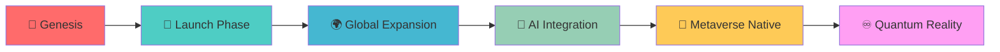

# 🌐 **GIVVE** 
### *Entering the Digital Reality*

<div align="center">


</div>

---

## 🚀 **MISSION PROTOCOL**

```bash
> Initializing GIVVE Systems...
> Loading Metaverse Infrastructure...
> Status: OPERATIONAL ✓
> Reality Level: ENHANCED
```

**GIVVE** is pioneering the next frontier of digital experiences, creating immersive solutions that bridge the gap between reality and virtual worlds. We don't just build applications—we craft digital universes.

---

## ⚡ **CORE SYSTEMS**

<table>
<tr>
<td width="50%">

### 🔮 **QUANTUM STACK**
- **Frontend Reality Engine**
- **Blockchain Neural Network**  
- **AI-Powered Metaverse APIs**
- **Cross-Platform Compatibility Matrix**

</td>
<td width="50%">

### 🎯 **MISSION OBJECTIVES**
- ✨ Redefine Digital Interaction
- 🌍 Build Sustainable Virtual Ecosystems  
- 🤖 Integrate AI-Native Experiences
- 🔗 Connect Global Communities

</td>
</tr>
</table>

---

## 🛸 **ACTIVE PROJECTS**

<div align="center">

| PROJECT | STATUS | REALITY LEVEL | TECH STACK |
|---------|--------|---------------|------------|
| 🌌 **MetaGivve** | `LIVE` | 🟢 Enhanced | React, Three.js, WebXR |
| 🎮 **GameVerse** | `BETA` | 🟡 Experimental | Unity, Blockchain, AI |
| 🏗️ **BuildSpace** | `ALPHA` | 🔴 Prototype | Next.js, GraphQL, AR |
| 🔮 **QuantumAPI** | `DEV` | ⚪ Conceptual | Node.js, TensorFlow, IoT |

</div>

---

## 🌈 **EXPERIENCE MATRIX**

```yaml
Technologies:
  Frontend: ["React", "Vue.js", "Three.js", "WebGL", "WebXR"]
  Backend: ["Node.js", "Python", "GraphQL", "Microservices"]
  Blockchain: ["Ethereum", "Solidity", "Web3.js", "IPFS"]
  AI/ML: ["TensorFlow", "PyTorch", "Computer Vision", "NLP"]
  Cloud: ["AWS", "Azure", "Docker", "Kubernetes"]
  
Specializations:
  - 🥽 Virtual & Augmented Reality
  - 🎮 Interactive 3D Experiences  
  - 🔗 Decentralized Applications
  - 🤖 AI-Powered Interfaces
  - 📱 Cross-Platform Solutions
```

---

## 🎭 **TEAM NEXUS**

<div align="center">

### *Digital Architects • Reality Engineers • Experience Designers*

We're a collective of innovators, dreamers, and builders who believe the future is immersive, decentralized, and extraordinary.

**🔍 Always seeking exceptional talent to join our reality-shaping mission**

</div>

---

## 📡 **CONNECT TO THE GRID**

<div align="center">

[](https://givve.com)
[](https://discord.gg/givve)
[](https://twitter.com/givve_org)
[](https://linkedin.com/company/givve)

</div>

---

## 🌟 **CONTRIBUTION PROTOCOL**

```bash
# Clone the future
git clone https://github.com/givve/project-name.git

# Install dependencies
npm install --save-dev @givve/metaverse-tools

# Launch development environment  
npm run dev:metaverse

# Deploy to production reality
npm run deploy:quantum
```

### **Code Standards**
- 🎨 Write code that reads like poetry
- 🧪 Test in multiple realities
- 📚 Document for the multiverse
- 🔄 Commit to continuous evolution

---

## 🏆 **ACHIEVEMENTS UNLOCKED**

<div align="center">


</div>

---

## 🔮 **ROADMAP TO INFINITY**

<div align="center">



</div>

---

<div align="center">

### 💎 **"Building Tomorrow's Digital Reality, Today"**

*Join us in shaping the future of human-computer interaction*

---

**⚡ GIVVE • EST. 2024 • REALITY: ENHANCED ⚡**

</div>

---

<div align="center">
<sub>🔄 This README is dynamically updated • Last sync: <code>REALTIME</code></sub>
</div>
